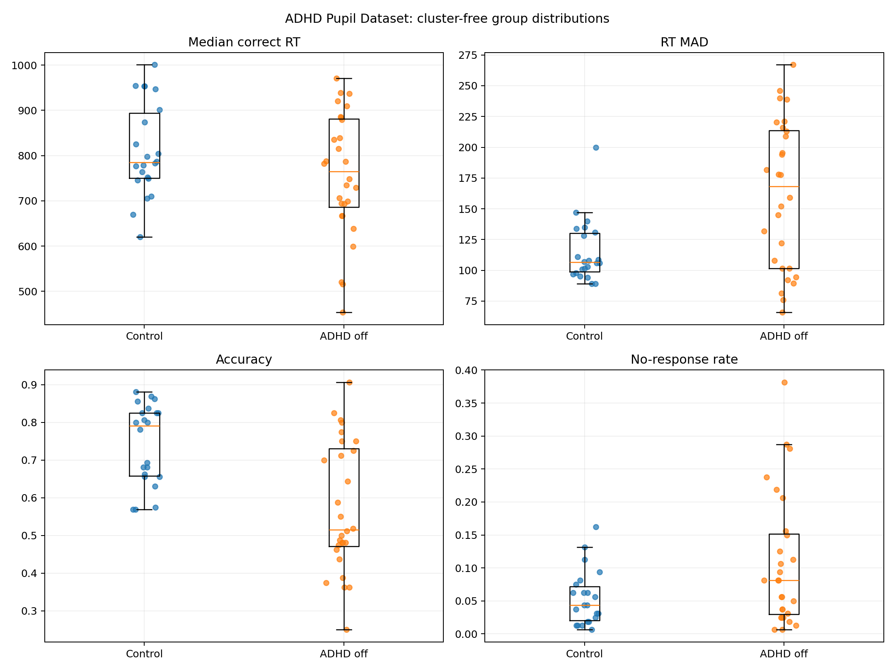
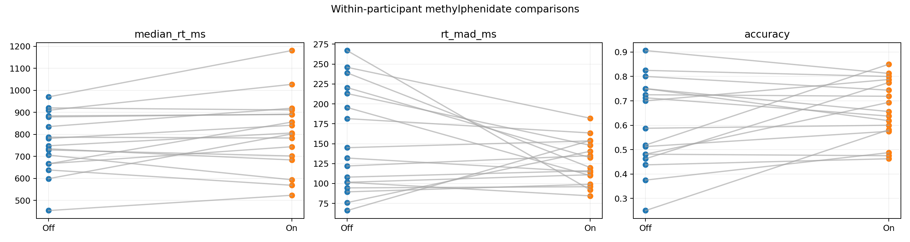
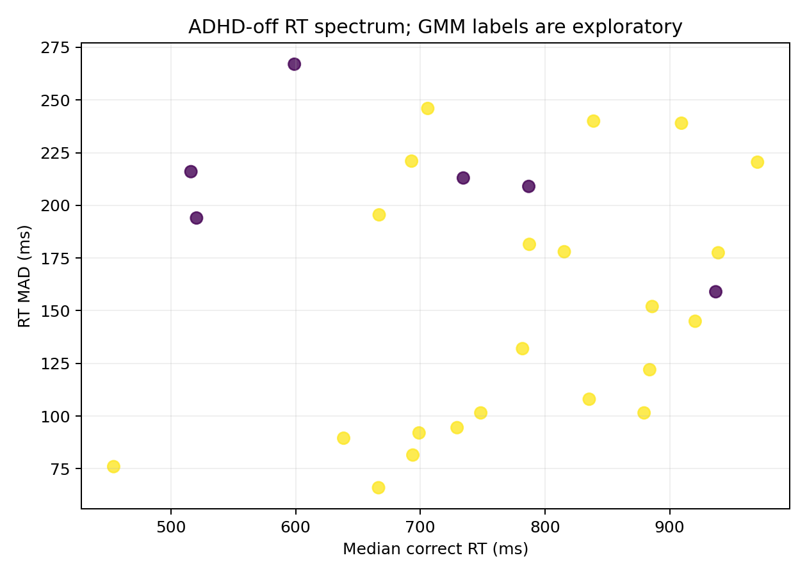
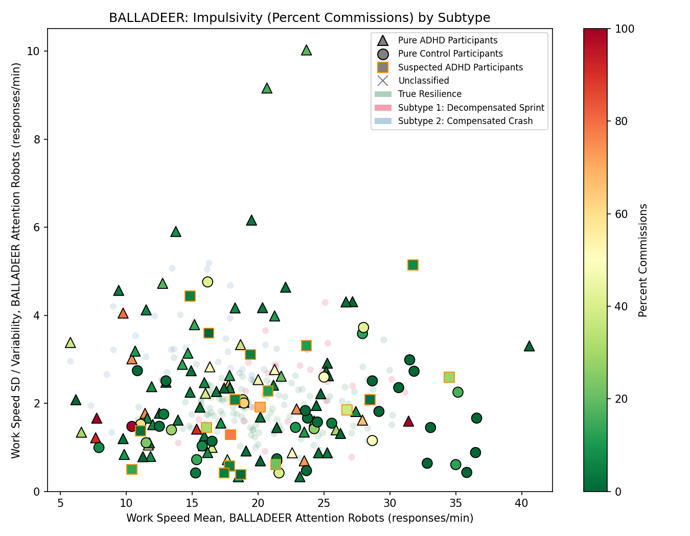
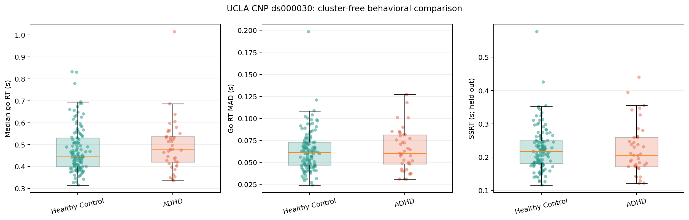
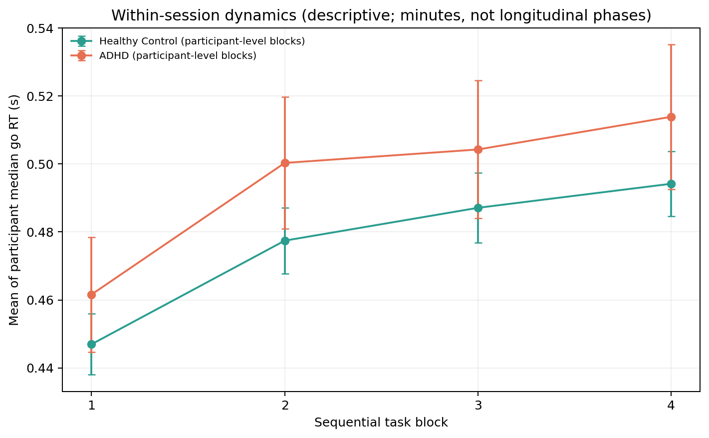

# Allostatic Sprint Hypothesis — Exploring Behavioral Instability in ADHD

<p align="center">
  <a href="https://doi.org/10.5281/zenodo.21304761"></a>
  
  
  
  
</p>

<p align="center">
  
  
  
  
  
  
</p>

**Not a diagnostic or clinical tool.** This is an exploratory, independently produced, non-peer-reviewed project. Positive, null, and methodologically inconclusive findings are retained together. The analyses do not justify individual diagnosis, treatment selection, medication advice, or claims about dopamine, ATP, receptor state, or metabolism.

## Overview

This project examines whether ADHD-related task performance is better described by uniform impairment, stable behavioral subtypes, or a continuous and context-dependent space of speed, variability, accuracy, and inhibitory control.

The project began with an informal **Allostatic Sprint** hypothesis proposing two contrasting patterns: a relatively fast but disinhibited Sprint-like pole and a slower, more variable Crash-like pole. Four independent public datasets have now been examined:

1. **HYPERAKTIV** — clinical CPT-II data used for initial exploration.
2. **BALLADEER** — a CPT/go-no-go-like attention task with diagnostically characterized participants.
3. **UCLA CNP / OpenNeuro `ds000030`** — an adult Stop-Signal Task used for a cluster-free conceptual replication.
4. **ADHD Pupil Dataset / Figshare `7218725`** — a pediatric visuospatial working-memory task with trial-level reaction time, accuracy, distractor conditions, and paired off/on-methylphenidate sessions for a subset.

The accumulated evidence does **not** support permanent, task-general Sprint/Crash subtypes. It does provide emerging, task-dependent evidence that ADHD-related impairment can be expressed as unstable performance rather than uniform slowing. The strongest new result is the ADHD Pupil analysis: median reaction time did not differ significantly, while robust reaction-time variability was greater and accuracy was lower in off-medication ADHD participants than controls.

This pattern supports the broad behavioral premise of unstable cognitive-state regulation and is compatible with a dimensional formulation. It does not validate the proposed allostatic, dopaminergic, metabolic, or pupillary mechanism.

## Current Evidence at a Glance

| Dataset | Primary comparison | Sample | Main result | Interpretation |
|---|---|---:|---|---|
| BALLADEER, historical v1.0.0 | ADHD vs neurotypical controls within an anchor-defined cluster | 20 vs 20 | Mann–Whitney p = 0.011; permutation p = 0.014 | Task-specific positive result, but partly circular because accuracy-related information contributed to cluster formation |
| HYPERAKTIV | ADHD vs clinical controls within an analogous cluster | 24 vs 11 | p = 0.0312; permutation p = 0.042; Bonferroni α = 0.0167 | Directionally similar but corrected-nonsignificant; controls are clinical, not confirmed healthy |
| UCLA CNP | All eligible ADHD vs healthy controls, cluster-free | 41 vs 126 | All primary location and dispersion tests nonsignificant | Substantive null conceptual replication on Stop-Signal measures |
| ADHD Pupil | ADHD off medication vs controls, cluster-free | 28 vs 22 | RT MAD and IQR: Holm p = 0.0088; accuracy: Holm p = 0.001; median RT: Holm p = 0.448 | Independent support for behavioral instability without uniform slowing |
| ADHD Pupil medication | Paired on vs off methylphenidate | 17 pairs | No endpoint survived Holm correction | Medication effects remain inconclusive |
| UCLA and ADHD Pupil clustering | ADHD-only GMM with stability gates | 41 and 28 ADHD | No acceptable stable two-cluster solution | Discrete task-general subtypes not supported |

## ADHD Pupil Dataset: Corrected Cluster-Free Analysis

### Design and quality control

The corrected `ADHD_PUPIL_VALIDATOR.py` analysis decoded the official MATLAB 7.3/MCOS file and recovered:

- 50 unique participants;
- 67 sessions;
- 10,720 trials;
- 28 off-medication ADHD sessions;
- 22 control sessions;
- 17 paired on-medication ADHD sessions;
- exactly 160 trials per session.

The downloaded file matched the official Figshare MD5 checksum and had SHA-256:

```text
44aa997e37815e7d2a003a4fc4e967f69438a86bdf04650b02f37aaa2a81819b
```

Missing `Perform` values were conservatively scored as no-response/omission errors. Accuracy therefore uses all trials. The four-level `Distractor` factor (`3`, `4`, `5`, `6`) was treated categorically; order-invariant max-minus-min ranges were analyzed as secondary endpoints. Pupil time-series vectors were not included in the primary behavioral analysis.

### Primary results

Off-medication ADHD participants did not show uniform slowing:

- median correct RT difference, ADHD minus control: **−19.5 ms**;
- permutation p = **0.4479**;
- Holm-adjusted p = **0.4479**.

They did show greater robust RT variability:

- RT MAD difference: **+61.75 ms**; permutation p = **0.0022**; Holm p = **0.0088**;
- RT IQR difference: **+99.63 ms**; permutation p = **0.0024**; Holm p = **0.0088**;
- Brown–Forsythe dispersion tests were also significant for MAD and IQR (`p < 0.0001`).

Accuracy was lower when no-response trials were scored as errors:

- accuracy difference: **−0.275**;
- permutation p = **0.0002**;
- Holm p = **0.0010**.

The median omission-rate difference did not survive correction:

- omission-rate difference: **+0.0375**;
- permutation p = **0.1054**;
- Holm p = **0.2108**.

Thus, the accuracy result cannot be reduced to a significant median omission-rate difference alone.

<p align="center">
  
</p>
<p align="center"><sub>Corrected cluster-free distributions. ADHD showed greater RT variability and lower accuracy without a significant median-RT difference. No-response values were scored as omission errors.</sub></p>

### Secondary condition and medication results

Temporal slopes, memory-load contrasts, and four-level distractor-range endpoints did not survive Holm correction. The nominal distractor RT-range and accuracy-range results are retained as exploratory, not confirmatory.

Among 17 paired off/on-methylphenidate sessions, no endpoint survived Holm correction. Descriptive changes in RT variability, omissions, or distractor sensitivity therefore remain inconclusive and should not be interpreted as treatment effects.

<p align="center">
  
</p>
<p align="center"><sub>Within-participant medication comparisons. Individual trajectories are heterogeneous; no tested endpoint survived multiplicity correction.</sub></p>

### Exploratory clustering

The ADHD-only GMM was restricted to RT-derived features. Diagnosis and control data did not define components, and accuracy remained a held-out outcome. A two-component interpretation required BIC, silhouette, minimum-size, and bootstrap-stability gates.

The corrected analysis returned:

```text
stable_two_cluster = False
```

The plotted colors are exploratory component assignments, not validated subtypes.

<p align="center">
  
</p>
<p align="center"><sub>The ADHD-off sample occupies a broad RT/variability space. GMM labels failed the stability gates and must not be interpreted as Sprint/Crash subtypes.</sub></p>

## Earlier Datasets

### BALLADEER and HYPERAKTIV

The historical BALLADEER v1.0.0 analysis found a commission-error difference within one anchor-defined cluster (p = 0.011; permutation p = 0.014). HYPERAKTIV showed a directionally similar but corrected-nonsignificant result (p = 0.0312; permutation p = 0.042; Bonferroni α = 0.0167).

These legacy analyses used forced hypothesis anchors, and accuracy/commission-related information contributed to cluster formation before commission errors were compared. The positive BALLADEER result is therefore retained as historical, task-specific, and methodologically qualified—not as clean evidence for a biological subtype.

<table>
<tr>
<td width="50%"></td>
<td width="50%"></td>
</tr>
</table>

A cluster-free BALLADEER v1.0.1 candidate has been written but has not yet completed a real-data rerun. No new BALLADEER numerical result should be claimed until that rerun occurs.

### UCLA CNP

The UCLA CNP validator provided a cluster-free adult Stop-Signal conceptual replication. ADHD and healthy-control participants did not differ significantly in median go RT, go RT MAD, go RT IQR, omission rate, or SSRT. Brown–Forsythe tests also found no significant increase in ADHD dispersion.

A nominally separated two-component GMM failed the minimum-size gate because the smaller component contained one of 41 ADHD participants. It was treated as an outlier-like component, not a subtype.

<table>
<tr>
<td width="58%"></td>
<td width="42%"></td>
</tr>
</table>

## Dimensional Reformulation

The current evidence is more consistent with a continuous and context-dependent behavioral space than with permanent categories. Relevant dimensions include:

- response speed;
- temporal stability and RT variability;
- accuracy and response policy;
- omission tendency;
- inhibitory control;
- sensitivity to task demands;
- within-person state and medication context.

Sprint-like and Crash-like patterns should therefore be treated as descriptive poles, not diagnoses or immutable kinds of people. The ADHD Pupil result strengthens this reformulation because robust variability and accuracy differed despite similar median RT, while discrete clustering again failed.

The UCLA null remains important. It shows that increased variability is not universal across every task, age group, or response-inhibition construct. The responsible synthesis is **task-dependent evidence for behavioral instability**, not a universal ADHD signature.

## Methodology

### General inferential principles

- Primary comparisons are cluster-free whenever feasible.
- Group location uses two-sided Mann–Whitney U, rank-biserial effect sizes, bootstrap confidence intervals, and median-difference permutation tests.
- Group dispersion uses median-centered Brown–Forsythe tests.
- Related endpoint families use multiplicity correction.
- Secondary ADHD-only GMMs must pass BIC, silhouette, minimum-component-size, and bootstrap-stability gates.
- Failed clustering gates remain failed; subtype labels are not forced.
- Behavioral effects are not treated as evidence of a molecular mechanism.

### ADHD Pupil analysis

- 5,000 label permutations;
- 2,000 bootstrap repetitions;
- fixed seed `20260717`;
- RT validity window: 100–5,000 ms;
- minimum 20 valid correct-RT trials per session;
- missing `Perform` scored as no-response error;
- four-level distractor summaries analyzed categorically and by order-invariant ranges;
- paired off/on medication tests with paired permutation and Holm correction;
- MATLAB 7.3 MCOS tables decoded with `mat73-reader==0.1.0`.

### UCLA CNP analysis

- 5,000 label permutations and 500 bootstrap repetitions;
- selective retrieval of public phenotype and Stop-Signal event files;
- no MRI download;
- cluster-free ADHD-control primary analysis;
- ADHD-only secondary GMM with held-out SSRT validation.

## Datasets and Attribution

- **HYPERAKTIV** — Hicks et al. Open clinical CPT-II dataset. Its comparison group contains other psychiatric diagnoses and is not a confirmed-healthy sample. Verify current terms before reuse.
- **BALLADEER** — Trujillo, Ferrer-Cascales, Teruel et al., *Scientific Data* (2026), [doi:10.1038/s41597-026-06758-7](https://doi.org/10.1038/s41597-026-06758-7). Verify repository terms before data redistribution.
- **UCLA CNP / OpenNeuro `ds000030`** — Bilder, Poldrack, Cannon, London, Freimer, Congdon, Karlsgodt, Sabb, and colleagues, *Scientific Data* (2016), [doi:10.1038/sdata.2016.110](https://doi.org/10.1038/sdata.2016.110); [OpenNeuro ds000030](https://openneuro.org/datasets/ds000030). Distributed under PDDL on OpenNeuro.
- **ADHD Pupil Dataset / Figshare `7218725`** — Rojas-Líbano, Wainstein, and Ossandón, “A pupil size, eye-tracking and neuropsychological dataset from ADHD children during a cognitive task,” *Scientific Data* (2019), [doi:10.1038/s41597-019-0037-2](https://doi.org/10.1038/s41597-019-0037-2); [Figshare dataset](https://doi.org/10.6084/m9.figshare.7218725). Dataset license: CC BY 4.0.

Raw participant data are not redistributed here. The repository includes analysis code, aggregated diagnostics, and figures. Cite each original dataset when reusing code or results.

## Limitations

- Exploratory, independently produced, not preregistered, and not peer reviewed.
- Multiple analytic iterations create researcher degrees of freedom beyond within-run corrections.
- BALLADEER and HYPERAKTIV retain legacy forced-anchor and circularity concerns.
- HYPERAKTIV uses clinical rather than confirmed-healthy controls.
- UCLA CNP is an adult Stop-Signal conceptual replication and yielded a substantive null.
- ADHD Pupil is a pediatric working-memory task, not a Go/No-Go or CPT replication.
- Missing `Perform` was conservatively treated as no-response error; alternative coding should be reported as sensitivity analysis if used.
- ADHD Pupil distractor-range endpoints measure modulation magnitude, not a directional ordered effect.
- Only 17 paired medication sessions were available; medication results were nonsignificant after correction.
- Pupil time series were not analyzed in the reported primary run.
- Cross-sectional and single-session data cannot establish weeks-to-months state cycles.
- No direct receptor, neurotransmitter, metabolic, neural, or causal measurement exists.

## Reproducing the Analyses

### Install dependencies

```bash
python -m pip install -r requirements.txt
```

### Run validators

```bash
python scripts/CLINICAL_VALID_HYPERAKTIV.py
python scripts/HEALTHY_VALID_BALLADEER.py
python scripts/UCLA_CNP_VALIDATOR.py
python scripts/ADHD_PUPIL_VALIDATOR.py
```

The ADHD Pupil validator downloads the official 1.258 GB Figshare MATLAB file, verifies size and MD5, decodes MCOS tables, creates diagnostics and figures, and removes raw data after success unless `--keep-data` is supplied.

### Google Colab

Upload the desired validator to `/content` and run, for example:

```python
!python /content/ADHD_PUPIL_VALIDATOR.py --keep-data
```

The validator creates `ADHD_PUPIL_VALID_output.zip` and initiates a browser download.

## Recommended Repository Outputs

```text
scripts/ADHD_PUPIL_VALIDATOR.py
images/adhd_pupil_group_distributions.png
images/adhd_pupil_medication_pairs.png
images/adhd_pupil_dimensional_spectrum.png
docs/results/adhd_pupil/adhd_pupil_academic_diagnostic.txt
docs/results/adhd_pupil/adhd_pupil_analysis_config.json
docs/results/adhd_pupil/adhd_pupil_reproducibility_log.txt
docs/results/adhd_pupil/RESULTS.md
```

Do not commit the 1.258 GB MATLAB source file. Participant-level trial exports should not be committed without separately reviewing the dataset license, attribution requirements, and privacy standard.

## Interpretation Boundaries

The repository now supports these narrow conclusions:

- the historical BALLADEER analysis contains one positive but methodologically qualified task-specific result;
- HYPERAKTIV contains a directionally similar but corrected-nonsignificant trend;
- UCLA CNP is a substantive cluster-free null conceptual replication;
- ADHD Pupil independently shows greater RT variability and lower accuracy without significant median-RT slowing;
- stable task-general discrete Sprint/Crash subtypes are not supported;
- a dimensional, context-sensitive behavioral-instability formulation has stronger empirical motivation but is not proven;
- the allostatic, dopaminergic, metabolic, pupillary, diagnostic, and treatment mechanisms remain untested.

## Version Status

The public release remains `v1.0.0`. This repository bundle is a **candidate for v1.1.0** because it adds a new independent dataset, validator, corrected scoring rules, figures, and evidence synthesis. Do not create or move a release tag until the final file set and hashes are reviewed. The pending cluster-free BALLADEER rerun remains separate and must not be described as completed.

## Acknowledgments

Developed iteratively with AI assistance for coding, statistical guidance, visualization, and methodological critique. Conceptual direction, analytic decisions, interpretations, and errors remain the author’s responsibility.

## License

Original software code is licensed under the MIT License; see `LICENSE`.

Original documentation, figures, tables, and aggregated research outputs are
licensed under CC BY 4.0; see `LICENSE-CONTENT.txt`.

Third-party datasets and materials remain governed by their original licenses
and terms.

## Author

D1D2DOPAMINE
