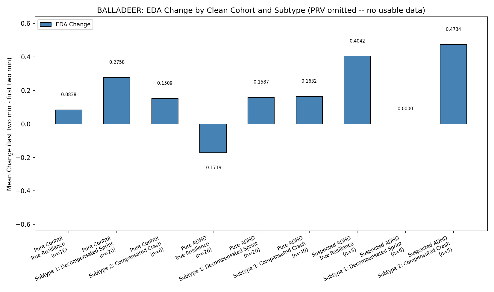

# Allostatic Sprint Hypothesis — Exploring Impulsivity Heterogeneity in ADHD

<p align="center">
  <a href="https://doi.org/10.5281/zenodo.21304761"></a>
  
  
  
  
</p>

<p align="center">
  
  
  
  
</p>

**Not a diagnostic or clinical tool.** Findings are preliminary and independently produced — see limitations below before citing anything here.

## Overview

This project explores whether ADHD is behaviorally heterogeneous with respect to impulsivity on continuous-performance / go-no-go style attention tasks, using two independent, publicly available datasets. It originated from an informal hypothesis ("Allostatic Sprint") proposing two behavioral subtypes of ADHD decompensation. Some parts of that hypothesis held up under testing; others did not. Both are reported here — the scorecard above is the honest summary, everything below is the full detail behind it.

## What Was Tested, and What the Data Actually Showed

**Supported:**
- ADHD samples show real heterogeneity in impulsivity (commission-error rate) relative to genuine neurotypical controls. A subgroup of ADHD participants ("Decompensated Sprint" cluster) shows significantly higher commission rates than clean, non-ADHD controls.
  - BALLADEER dataset, diagnostically clean subsample (confirmed ADHD vs. confirmed non-ADHD, ambiguous/"suspected" cases excluded): Mann-Whitney U, n = 20 vs 20, p = 0.011 (survives Bonferroni correction across 3 clusters, α = 0.0167), rank-biserial r ≈ -0.465. Confirmed by a label-permutation test (empirical p = 0.014).
  - The same direction of effect appears in the HYPERAKTIV dataset (Mann-Whitney U, p = 0.031, r = -0.462; permutation-test empirical p = 0.042), but does **not** clear the same Bonferroni-corrected threshold there, and the comparison group in HYPERAKTIV is *clinical* controls (participants with other psychiatric diagnoses), not confirmed-healthy individuals — a weaker comparison. Treat this as a consistent trend, not as a second independently significant confirmation. (An earlier, uncorrected version of this analysis reported p = 0.0004 on HYPERAKTIV; that number came from a flawed pipeline — see `docs/analysis_log.md` — and should be disregarded in favor of the corrected p = 0.031 above.)
- This heterogeneity itself is consistent with the broader published ADHD literature on reaction-time variability and commission-error heterogeneity (e.g., Kofler et al., 2013 meta-analysis) — this project largely **replicates**, rather than newly discovers, that pattern.

<table>
<tr>
<td width="50%"></td>
<td width="50%"></td>
</tr>
</table>
<p align="center"><sub>Descriptive plots of the clustering used. Not evidence of separate neural mechanisms — mechanism was never measured (see below).</sub></p>

**Not supported:**
- The hypothesis that the two proposed subtypes ("Decompensated Sprint" vs. "Compensated Crash") follow *different trajectories over time within a task* (stable fast-but-impulsive vs. progressive fatigue/collapse) was tested directly with a mixed-effects model (`commission ~ block × cluster`, Pure-ADHD only) and came back flat (p = 0.847). The two clusters differ in baseline impulsivity, not in how that impulsivity changes across the task. This specific test was likely underpowered (only 4 of 20 "Sprint" participants had complete 4-block data), so it should be read as inconclusive rather than a clean disproof — but it does **not** support the original claim.
- No physiological signature distinguishing the two subtypes was found in the available data (see PRV note below).

<p align="center">
  
</p>
<p align="center"><sub>The physiological angle that didn't pan out: no clear pattern separating subtypes in skin-conductance change. Posted here rather than quietly dropped.</sub></p>

**Untested (not measured, not claimed as fact):**
- Any dopaminergic (D1/D2 receptor) or ATP-depletion mechanism. This was always a narrative/motivating metaphor for the behavioral pattern, never something this project measured. No receptor imaging, pharmacology, or direct physiological validation of this mechanism exists here or is claimed.
- PRV (pulse-rate variability), originally intended as the key physiological marker for the "Compensated Crash" subtype, is missing (NaN) across all participants and sources in this BALLADEER export. This is a data-availability gap, not a negative finding — the physiological hypothesis remains untested rather than disproven.

## Methodology (brief)

1. Cluster "anchors" (Work Speed Mean, Work Speed SD, Accuracy %) are derived empirically from each dataset rather than fixed in advance.
2. Participants are assigned to the nearest anchor by z-scaled Euclidean distance.
3. Group differences within each cluster are tested with Mann-Whitney U, Bonferroni-corrected across clusters, and cross-checked with a label-permutation test.

**Known methodological caveat (circularity):** because Accuracy/commission rate is one of the three axes used to *define* the clusters, the "Decompensated Sprint" cluster is partly, though not entirely, defined by low accuracy — so finding an accuracy/commission difference in that cluster is a partially expected consequence of the clustering method itself, not purely an independent discovery. A cluster-free confirmation (e.g., a mixed model on the full sample without pre-assigned clusters) is a planned follow-up.

## Datasets & Attribution

- **HYPERAKTIV** — Hicks et al. Used for initial exploration. Control group in this dataset consists of *clinical* controls (other psychiatric diagnoses), not healthy individuals — please label it accordingly if reusing. Check current license terms before redistribution.
- **BALLADEER** — Trujillo, Ferrer-Cascales, Teruel et al., *Scientific Data* (2026), https://doi.org/10.1038/s41597-026-06758-7. Includes genuine neurotypical controls. Check the dataset's license (CC BY-NC-ND applies to the article; verify the data's own license on its repository before reuse/redistribution).

Neither dataset's raw data is redistributed in this repository; only derived, aggregated statistics and analysis code are included. Please cite the original dataset papers if you reuse this code on their data.

## Limitations (full list)

- Small subgroup sizes in several comparisons (n as low as 4–20).
- Forced classification into 3 predefined clusters rather than unsupervised discovery of natural groupings.
- Partial circularity between cluster-defining variables and outcome variables (see above).
- No independent (third) dataset replication yet.
- No physiological/mechanistic validation of any kind.
- Analysis pipeline went through multiple iterations; while each individual test reported here applies proper correction, the broader iterative process carries some risk of researcher degrees of freedom that a pre-registered replication would eliminate.

## Reproducing the Analysis

```
pip install pandas numpy scipy matplotlib --break-system-packages
python HEALTHY_VALID_BALLADEER.py
```
Requires the BALLADEER dataset files placed in the expected directory structure (see script header).

## Acknowledgments

Developed iteratively with the help of AI assistants (Claude, Gemini) for coding, statistical guidance, and methodological critique. All conceptual direction, decisions, and errors are the author's own; AI-generated interpretations were independently checked against the data and, where wrong, corrected in this document.

## License

Code in this repository: MIT License (feel free to change if you prefer something else).
Data: not included; governed by the original datasets' own licenses (see above).

## Author

D1D2DOPAMINE
